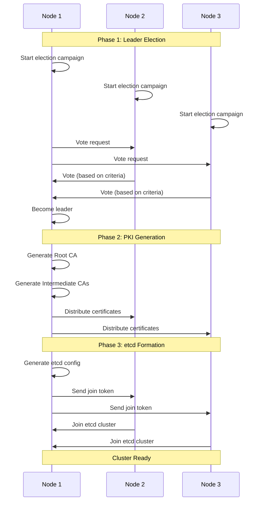

# Feature: Cluster Bootstrap

## Overview
The Cluster Bootstrap feature enables autonomous Kubernetes cluster formation on Bottlerocket nodes without manual intervention, providing deterministic leader election, FIPS-compliant PKI generation, and automated etcd cluster formation.

## Status
- **Feature Status**: 📋 Planned
- **Target Release**: v1.1.0
- **Feature Owner**: Platform Team
- **Last Updated**: 2025-01-21
- **Dependencies**: Platform Control Agent v1.0.0

## Summary
Cluster Bootstrap transforms bare Bottlerocket nodes into a fully-functional Kubernetes control plane through API-driven coordination. Nodes automatically elect a leader, generate a complete PKI hierarchy, and form an etcd cluster - all without manual configuration or external dependencies.

## Key Capabilities

### 1. Leader Election
**Deterministic leadership for bootstrap coordination**
- Raft-based consensus algorithm
- Split-brain prevention
- Network partition tolerance
- Automatic re-election on failure
- Observable election state via API

### 2. PKI Generation & Distribution
**FIPS-compliant certificate authority**
- Automated CA generation on leader
- Secure certificate distribution to followers
- Certificate lifecycle management
- Automatic renewal before expiry
- Hardware security module (HSM) support

### 3. etcd Cluster Formation
**Automated etcd bootstrapping**
- Static pod generation
- Initial cluster formation
- Member management (add/remove)
- Automated backup/restore
- Disaster recovery procedures

## Technical Architecture

### Component Overview
```
┌─────────────────────────────────────────────────────────────┐
│                     Platform Control Agent                   │
├─────────────────────────────────────────────────────────────┤
│                                                             │
│  ┌─────────────────┐  ┌──────────────┐  ┌──────────────┐ │
│  │ Election Service │  │ PKI Service  │  │ etcd Service │ │
│  └────────┬─────────┘  └──────┬───────┘  └──────┬───────┘ │
│           │                    │                  │         │
│  ┌────────▼─────────────────────▼─────────────────▼───────┐ │
│  │              Bootstrap Coordinator                      │ │
│  └─────────────────────────────────────────────────────────┘ │
│                                                             │
└─────────────────────────────────────────────────────────────┘
```

### Bootstrap Flow


## API Specification

### Election Service
```protobuf
service ElectionService {
  // Get current leader information
  rpc GetLeader(GetLeaderRequest) returns (GetLeaderResponse);
  
  // Campaign to become leader
  rpc Campaign(CampaignRequest) returns (CampaignResponse);
  
  // Resign from leadership
  rpc Resign(ResignRequest) returns (ResignResponse);
  
  // Stream election events
  rpc ObserveElection(ObserveRequest) returns (stream ElectionEvent);
}

message ElectionState {
  string leader_id = 1;
  int64 term = 2;
  repeated string candidates = 3;
  google.protobuf.Timestamp last_heartbeat = 4;
  ElectionPhase phase = 5;
}

enum ElectionPhase {
  ELECTION_PHASE_UNKNOWN = 0;
  ELECTION_PHASE_FOLLOWER = 1;
  ELECTION_PHASE_CANDIDATE = 2;
  ELECTION_PHASE_LEADER = 3;
}
```

### PKI Service
```protobuf
service PKIService {
  // Initialize PKI (leader only)
  rpc InitializePKI(InitializePKIRequest) returns (InitializePKIResponse);
  
  // Request certificate
  rpc RequestCertificate(CertificateRequest) returns (CertificateResponse);
  
  // Renew certificate
  rpc RenewCertificate(RenewRequest) returns (CertificateResponse);
  
  // Get CA bundle
  rpc GetCABundle(GetCABundleRequest) returns (CABundleResponse);
}

message Certificate {
  string common_name = 1;
  bytes cert_data = 2;
  bytes key_data = 3;  // Encrypted
  google.protobuf.Timestamp not_before = 4;
  google.protobuf.Timestamp not_after = 5;
  CertificateType type = 6;
  repeated string san = 7;  // Subject Alternative Names
}

enum CertificateType {
  CERTIFICATE_TYPE_UNKNOWN = 0;
  CERTIFICATE_TYPE_ROOT_CA = 1;
  CERTIFICATE_TYPE_INTERMEDIATE_CA = 2;
  CERTIFICATE_TYPE_SERVER = 3;
  CERTIFICATE_TYPE_CLIENT = 4;
  CERTIFICATE_TYPE_PEER = 5;
}
```

### etcd Service
```protobuf
service EtcdService {
  // Initialize etcd cluster (leader only)
  rpc InitializeCluster(InitializeEtcdRequest) returns (InitializeEtcdResponse);
  
  // Join existing cluster
  rpc JoinCluster(JoinEtcdRequest) returns (JoinEtcdResponse);
  
  // Get cluster status
  rpc GetClusterStatus(GetEtcdStatusRequest) returns (EtcdClusterStatus);
  
  // Backup etcd data
  rpc BackupData(BackupRequest) returns (BackupResponse);
}

message EtcdConfig {
  repeated string initial_cluster = 1;
  string cluster_token = 2;
  TLSConfig tls = 3;
  map<string, string> extra_args = 4;
  string data_dir = 5;
  repeated string listen_peer_urls = 6;
  repeated string listen_client_urls = 7;
}

message EtcdClusterStatus {
  repeated EtcdMember members = 1;
  string leader_id = 2;
  int64 cluster_id = 3;
  int64 member_id = 4;
  int64 raft_term = 5;
  HealthStatus health = 6;
}
```

## Configuration

### MachineConfig Extension
```yaml
apiVersion: platform.io/v1alpha1
kind: MachineConfig
metadata:
  name: control-plane-bootstrap
spec:
  role: control-plane
  bootstrap:
    enabled: true
    electionConfig:
      # Higher priority for stable nodes
      priority: 100
      # Criteria for leader selection
      criteria:
        - minUptime: 300s
        - minMemory: 8Gi
        - networkStability: high
    pkiConfig:
      # Certificate specifications
      keyAlgorithm: RSA-4096
      signatureAlgorithm: SHA256WithRSA
      validity:
        rootCA: 10y
        intermediateCA: 5y
        serverCert: 1y
        clientCert: 1y
      # Subject configuration
      organization: "Platform Kubernetes"
      country: "US"
      locality: "Cloud"
    etcdConfig:
      version: "3.5.12"
      quotaBackendBytes: 8589934592  # 8GB
      autoCompactionMode: periodic
      autoCompactionRetention: "1h"
      snapshotCount: 10000
      heartbeatInterval: 100ms
      electionTimeout: 1000ms
```

## Implementation Details

### Leader Election Algorithm
```rust
// Simplified election logic
impl ElectionService {
    async fn campaign(&self) -> Result<ElectionResult> {
        // 1. Check eligibility
        let eligibility = self.check_eligibility().await?;
        if !eligibility.is_eligible {
            return Ok(ElectionResult::NotEligible(eligibility.reason));
        }
        
        // 2. Calculate priority score
        let score = self.calculate_priority_score().await?;
        
        // 3. Broadcast candidacy
        let votes = self.request_votes(score).await?;
        
        // 4. Check majority
        if votes.len() > self.cluster_size / 2 {
            self.become_leader().await?;
            Ok(ElectionResult::Elected)
        } else {
            Ok(ElectionResult::NotElected)
        }
    }
    
    fn calculate_priority_score(&self) -> u64 {
        let mut score = 0u64;
        
        // Uptime (max 1000 points)
        score += min(self.uptime_seconds / 60, 1000);
        
        // Available resources (max 500 points)
        score += min(self.available_memory_gb * 50, 500);
        
        // Network stability (max 500 points)
        score += self.network_stability_score;
        
        // User-defined priority (0-1000)
        score += self.config.priority;
        
        score
    }
}
```

### PKI Hierarchy
```
Root CA (10 years)
├── Kubernetes CA (5 years)
│   ├── API Server Certificate
│   ├── Controller Manager Certificate
│   ├── Scheduler Certificate
│   └── Kubelet Client Certificates
├── etcd CA (5 years)
│   ├── etcd Server Certificates
│   ├── etcd Peer Certificates
│   └── etcd Client Certificates
└── Front Proxy CA (5 years)
    └── Front Proxy Client Certificate
```

### etcd Static Pod Generation
```yaml
apiVersion: v1
kind: Pod
metadata:
  name: etcd
  namespace: kube-system
spec:
  hostNetwork: true
  containers:
  - name: etcd
    image: registry.k8s.io/etcd:3.5.12-fips
    command:
    - etcd
    - --advertise-client-urls=https://{{ .NodeIP }}:2379
    - --cert-file=/etc/kubernetes/pki/etcd/server.crt
    - --client-cert-auth=true
    - --data-dir=/var/lib/etcd
    - --initial-advertise-peer-urls=https://{{ .NodeIP }}:2380
    - --initial-cluster={{ .InitialCluster }}
    - --key-file=/etc/kubernetes/pki/etcd/server.key
    - --listen-client-urls=https://127.0.0.1:2379,https://{{ .NodeIP }}:2379
    - --listen-metrics-urls=http://127.0.0.1:2381
    - --listen-peer-urls=https://{{ .NodeIP }}:2380
    - --name={{ .NodeName }}
    - --peer-cert-file=/etc/kubernetes/pki/etcd/peer.crt
    - --peer-client-cert-auth=true
    - --peer-key-file=/etc/kubernetes/pki/etcd/peer.key
    - --peer-trusted-ca-file=/etc/kubernetes/pki/etcd/ca.crt
    - --snapshot-count=10000
    - --trusted-ca-file=/etc/kubernetes/pki/etcd/ca.crt
    volumeMounts:
    - mountPath: /var/lib/etcd
      name: etcd-data
    - mountPath: /etc/kubernetes/pki/etcd
      name: etcd-certs
  volumes:
  - hostPath:
      path: /var/lib/etcd
      type: DirectoryOrCreate
    name: etcd-data
  - hostPath:
      path: /etc/kubernetes/pki/etcd
      type: DirectoryOrCreate
    name: etcd-certs
```

## Exit Criteria

### 1. Leader Election
**Issue**: [#010](https://github.com/org/repo/issues/010)
- [ ] Deterministic leader election algorithm implementation
- [ ] Split-brain prevention mechanisms
- [ ] Network partition tolerance
- [ ] Leader failover in < 10 seconds
- [ ] Election status API with real-time updates
- [ ] Comprehensive election scenario testing

### 2. PKI Generation & Distribution
**Issue**: [#011](https://github.com/org/repo/issues/011)
- [ ] FIPS-compliant CA generation
- [ ] Complete certificate hierarchy for Kubernetes
- [ ] Secure distribution via encrypted channels
- [ ] Automatic renewal 30 days before expiry
- [ ] Certificate revocation support
- [ ] PKI backup and disaster recovery

### 3. etcd Cluster Formation
**Issue**: [#012](https://github.com/org/repo/issues/012)
- [ ] Automated static pod generation
- [ ] Initial cluster bootstrapping
- [ ] Member management (add/remove)
- [ ] FIPS-compliant TLS configuration
- [ ] Health monitoring and auto-recovery
- [ ] Backup/restore procedures

### 4. Testing & Validation
**Issue**: [#013](https://github.com/org/repo/issues/013)
- [ ] Unit tests for all components
- [ ] Integration tests for complete flow
- [ ] Chaos engineering scenarios
- [ ] Performance benchmarks
- [ ] Security audit
- [ ] Documentation

## Security Considerations

### Election Security
- **Authentication**: All election messages must be signed with node certificates
- **Authorization**: Only nodes with control-plane role can participate
- **Audit**: All election events are logged for compliance
- **Fencing**: Implement proper leader fencing to prevent split-brain

### PKI Security
- **Key Storage**: Private keys encrypted at rest using AES-256-GCM
- **Key Generation**: Use FIPS-validated crypto libraries
- **Access Control**: Strict RBAC for certificate operations
- **Rotation**: Automated rotation 30 days before expiry
- **Revocation**: Support for certificate revocation lists (CRL)

### etcd Security
- **Transport Security**: Mandatory TLS for all connections
- **Authentication**: Client certificate authentication
- **Encryption**: Support for encryption at rest
- **Access Control**: RBAC policies for etcd access
- **Backup Security**: Encrypted backups with versioning

## Testing Strategy

### Unit Tests
```bash
# Election algorithm tests
cargo test election::tests::test_priority_calculation
cargo test election::tests::test_vote_counting
cargo test election::tests::test_leader_fencing

# PKI generation tests
cargo test pki::tests::test_ca_generation
cargo test pki::tests::test_certificate_chain
cargo test pki::tests::test_certificate_renewal

# etcd configuration tests
cargo test etcd::tests::test_static_pod_generation
cargo test etcd::tests::test_cluster_formation
```

### Integration Tests
```bash
# Multi-node election scenario
./test/integration/test_election_three_nodes.sh

# PKI distribution test
./test/integration/test_pki_distribution.sh

# etcd cluster formation
./test/integration/test_etcd_formation.sh
```

### Chaos Tests
```yaml
# Network partition during election
- name: network-partition-election
  schedule: "0 */4 * * *"
  scenario:
    - partition:
        duration: 60s
        groups:
          - nodes: [node1]
          - nodes: [node2, node3]
    - verify:
        - noSplitBrain: true
        - leaderExists: true
        - eventualConsistency: 120s

# Certificate expiration handling
- name: certificate-expiration
  schedule: "0 0 * * 0"
  scenario:
    - timeskew:
        nodes: [node1]
        offset: "+30d"
    - verify:
        - certificateRenewed: true
        - noServiceDisruption: true
```

## Performance Requirements

### Election Performance
- Election completion: < 30 seconds
- Re-election after failure: < 10 seconds
- Vote processing: < 100ms per vote
- State replication: < 1 second

### PKI Performance
- CA generation: < 5 seconds
- Certificate issuance: < 2 seconds
- Certificate validation: < 50ms
- Bulk renewal: > 100 certs/minute

### etcd Performance
- Cluster formation: < 2 minutes for 3 nodes
- Write latency: < 10ms (p99)
- Read latency: < 5ms (p99)
- Snapshot time: < 30 seconds for 1GB

## Monitoring & Observability

### Metrics
```prometheus
# Election metrics
platform_election_state{node="node1"} 3  # 1=follower, 2=candidate, 3=leader
platform_election_term{node="node1"} 42
platform_election_last_heartbeat_seconds{node="node1"} 2
platform_election_campaigns_total{node="node1"} 5
platform_election_votes_received{node="node1"} 2

# PKI metrics
platform_pki_certificates_total{type="server"} 15
platform_pki_certificates_expiring{days="30"} 3
platform_pki_certificate_operations_total{op="issue"} 150
platform_pki_certificate_operations_duration_seconds{op="issue",p="0.99"} 1.5

# etcd metrics
platform_etcd_cluster_size 3
platform_etcd_has_leader 1
platform_etcd_leader_changes_total 2
platform_etcd_backend_bytes 1234567890
```

### Events
```json
{
  "type": "election.leader_changed",
  "timestamp": "2025-01-21T10:30:00Z",
  "data": {
    "previous_leader": "node-2",
    "new_leader": "node-1",
    "term": 42,
    "reason": "previous_leader_failed"
  }
}

{
  "type": "pki.certificate_issued",
  "timestamp": "2025-01-21T10:31:00Z",
  "data": {
    "common_name": "kube-apiserver",
    "type": "server",
    "validity_days": 365,
    "san": ["kubernetes", "kubernetes.default", "10.96.0.1"]
  }
}

{
  "type": "etcd.member_added",
  "timestamp": "2025-01-21T10:32:00Z",
  "data": {
    "member_id": "8e9e05c52164694d",
    "member_name": "node-3",
    "peer_urls": ["https://10.0.1.3:2380"]
  }
}
```

## Implementation Phases

### Phase 1: Leader Election (Weeks 5-6)
- Implement Raft-based consensus
- Test split-brain scenarios
- Performance validation
- API implementation

### Phase 2: PKI System (Weeks 6-7)
- Certificate generation logic
- Distribution mechanism
- Rotation procedures
- Security hardening

### Phase 3: etcd Formation (Weeks 7-8)
- Static pod generation
- Cluster bootstrapping
- Health monitoring
- Backup procedures

## Migration Path

### From Existing Clusters
1. **Assessment Phase**
   - Inventory existing certificates
   - Document current etcd topology
   - Identify custom configurations

2. **Preparation Phase**
   - Generate compatible PKI
   - Create migration configurations
   - Test in staging environment

3. **Migration Phase**
   - Rolling replacement of control plane nodes
   - Certificate rotation
   - etcd data migration

4. **Validation Phase**
   - Verify cluster functionality
   - Check certificate chains
   - Validate etcd health

## Known Limitations

1. **Cluster Size**: Optimized for 3-5 control plane nodes
2. **Network Requirements**: Requires reliable network for election
3. **Hardware Requirements**: Minimum 4 CPU, 8GB RAM for control plane
4. **Geographic Distribution**: Not optimized for geo-distributed clusters

## Future Enhancements

### Phase 2.1 (Q2 2025)
- External PKI integration (Vault, KMS)
- Multi-region election support
- IPv6 support for all components
- Automated etcd defragmentation

### Phase 2.2 (Q3 2025)
- Hardware security module (HSM) support
- Post-quantum cryptography readiness
- Advanced leader election strategies
- etcd performance auto-tuning

## Success Metrics
- Cluster formation time < 5 minutes
- Zero failed bootstraps in testing
- PKI rotation without downtime
- Automatic recovery from single node failure
- 99.99% availability for election service

## Related Features
- [Platform Control Agent](./platform-control-agent.md)
- [Machine Configuration](./machine-configuration.md)
- [Update Orchestration](./update-orchestration.md)
- [High Availability](./high-availability.md)