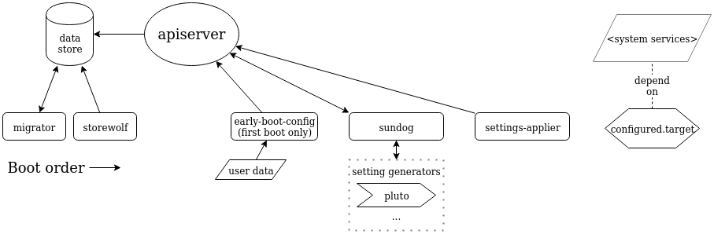

# Bottlerocket API system

This document describes the Bottlerocket API system.

In the [Background](#background) section, the API system's components are described in the order in which they start, so it's a handy reference for the boot process.

The [Development](#development) section has an overview of how to work on the API system.

## Background

Bottlerocket is intended to be an API-first operating system - direct user interaction with Bottlerocket is usually through the API.
However, the [API server](#apiserver) that handles requests is just one piece.
The remaining components make sure the system is up to date, and that requests are persisted and applied correctly.
Overall, it's the bridge between the user and the underlying system.
It aims to simplify common configuration, improve reliability, and reduce the need for the user to log in and debug.

Several components below mention the *data store*.
This is a key/value store that serves as the central storage location for the API system and tools using the API.
It's described in context in the [API server docs](apiserver/).

### API access

[Further docs](apiclient/)

Users can access the API through the `apiclient` binary.
It's available in Bottlerocket, whether you're accessing it through a control channel like SSM or the admin container.
(See the top-level [README](../../README.md#exploration) for information about those.)

Rust code can use the `apiclient` library to make requests to the Unix-domain socket of the [apiserver](#apiserver).

The API socket can be mounted and accessed from a privileged container.
An example pod specification to expose API access would be similar to:

```yaml
containers:
- name: my-api-access
  image: my-api-access
  volumeMounts:
  - name: socket
    mountPath: /run/api.sock
  privileged: true
volumes:
- name: socket
  hostPath:
  path: /run/api.sock
```

**NOTE:** There are some security considerations that you should be aware of when running privileged containers.
Refer to the [Security Guidance](https://github.com/bottlerocket-os/bottlerocket/blob/develop/SECURITY_GUIDANCE.md#restrict-access-to-the-host-api-socket) notes for more details.

## API system components



### migrator

Further docs:
* [migrator](migration/migrator/)
* [Migration system](migration/)

The migrator ensures the data store is up to date by running any applicable data store migrations.
The existing data store format version is found by looking at the symlink naming in `/var/lib/bottlerocket/datastore`, and the incoming data store format version is found by looking at `/etc/os-release` in the booting image.

On first boot, [storewolf](#storewolf) hasn’t run yet, so there’s no data store, so the migrator has nothing to do.

### storewolf

[Further docs](storewolf/)

storewolf owns the creation and initial population of the data store.

storewolf ensures the default values (defined in the `defaults.d` directory for each variant) are populated in the data store.
First, it has to create the data store directories and symlinks if they don’t exist.
Then, it goes key-by-key through the defaults, and if a key isn’t already set, sets it with the default value.

The settings are written to the *pending* section of the data store, in a "bottlerocket-launch" transaction, which is used for startup coordination.
This means they’re not available until committed later by [settings-committer](#settings-committer).

If there are any pending transactions in the data store when storewolf starts, they’re discarded.

### apiserver

[Further docs](apiserver/)

The API server for Bottlerocket starts next.
This gives users (and later components) the ability to read or change settings in the data store, and have any changes applied to the system.

### early-boot-config

[Further docs](early-boot-config/)

early-boot-config applies settings changes that the user requests through EC2 user data.
Think of it as cloud-init but smaller in scope; we only accept TOML-formatted settings that the API understands, right now.

It only runs on first boot.
Users wouldn’t expect settings they send to the API to be overridden every reboot by settings they sent at instance launch time.

The settings are PATCHed to the API and *not* committed, meaning they’re not available until committed later by [settings-committer](#settings-committer).

### sundog

[Further docs](sundog/)

Sundog sets any settings that can't be determined until after the OS is running.
For example, the primary IP address is needed in some config files but can only be determined after a network interface has been attached.

Sundog finds any settings with metadata (“setting-generator”) indicating that they must be generated after boot.
Each key is checked on every boot.
If the key is already set, we don’t need to generate it - either it was generated before, or overridden by the user.
If it’s not set, we could be handling a new key added in a Bottlerocket upgrade.

The settings are PATCHed to the API and *not* committed, meaning they’re not available until committed later by [settings-committer](#settings-committer).

#### Pluto

[Further docs](pluto/)

Pluto generates settings needed for Kubernetes configuration, for example cluster DNS.

### settings-committer

[Further docs](settings-committer/)

This binary sends a commit request to the API (by default for the "bottlerocket-launch" transaction) which moves all the pending settings from the above services into the live part of the data store.
It's called as a prerequisite of other services, like [sundog](#sundog) and [settings-applier](#settings-applier), that rely on settings being committed.

### settings-applier

Further docs:
* [thar-be-settings](thar-be-settings/), the tool settings-applier uses
* `defaults.d` directories (e.g. [aws-ecs-1](../models/src/aws-ecs-1/defaults.d/)) containing each variant's default settings, including configuration files and services

This is a simple startup service that runs `thar-be-settings --all` to write out all of the configuration files that are based on our settings.

Most of our root filesystem is not persistent.
We have this service so we can consistently write configuration files, regardless of whether there are any changes to commit during boot.

**Note:** `thar-be-settings --all` also runs service restart commands, which are written so that they don’t start services that haven’t been started yet, so it shouldn’t have an affect during boot.
None of the services above currently use API-configured settings.
Some day we may need to make an earlier service (say, apiserver) configurable through user settings, and that would correctly be restarted here.

**Note:** `thar-be-settings` is also run after the user applies changes through the API.
This usage is scoped to the keys that have changed, updating relevant config files and restarting affected services.
See [thar-be-settings](thar-be-settings/) docs.

## Boot stages

Bottlerocket's boot sequence includes three systemd targets:

- `preconfigured.target`: this is the target where all the aforementioned services run.
Once all the dynamically generated configurations are created, the system transitions to the next target
- `configured.target`: this is the target that represents the point at which the system is fully configured.
[Bootstrap containers](../../bootstrap-containers-settings) will run at this stage to apply further configurations in the system.
Once all bootstrap containers exit successfully, the system transitions to the next target
- `multi-user.target`: this is the target where the kubelet or the ECS agent run, at this point no further configurations are required in the running system.

## Development

### Local testing

#### Setup

First, you need a data store for the API server.
You can create a data store with storewolf.
These commands create one in `/tmp`, but you can create it in a more permanent location if desired.

From the `sources/api/storewolf` directory:

```shell
cargo run -- --data-store-base-path /tmp/data-store --version 0.0.1
```

Now you can start the API server.
From the `sources/api/apiserver` directory:

```shell
cargo run -- --datastore-path /tmp/data-store/current --socket-path /tmp/bottlerocket-api.sock --log-level debug
```

You can leave that running in a terminal, or background it, whatever you like.

When storewolf creates the data store, it puts settings into `pending` state.
This is so we can commit all settings generated at startup at once.

We can use settings-committer to do the same thing with our development data store.
From the `sources/api/settings-committer` directory:

```shell
cargo run -- --socket-path /tmp/bottlerocket-api.sock
```

Now you can inspect settings in the API or do any other testing you like.

You won't have dynamic settings generated by [sundog](#sundog) during a normal Bottlerocket launch, but you're probably not locally running the software that needs those, like Kubernetes.
If you are, you can set them manually; see the top-level README for descriptions of those settings.

#### Testing apiclient exec

When you use `apiclient exec`, the server needs to know the containerd socket it can use to run the requested command, and it needs root access to talk to containerd.
Here's how you can test the feature locally.

Follow the [setup steps above](#Setup) if you haven't already, then stop the apiserver, because we'll need to run it a different way.

First, run a task in containerd locally.  Here's an example:
```shell
sudo ctr i pull public.ecr.aws/amazonlinux/amazonlinux:latest
sudo ctr run --rm -t public.ecr.aws/amazonlinux/amazonlinux:latest al bash
```

If you use a containerd socket other than the default `/run/containerd/containerd.sock` then pass it to ctr with `-a PATH` on each of those commands.

Next, run apiserver as root so it can talk to containerd.
From the `sources` directory:
```shell
sudo target/debug/apiserver --datastore-path /tmp/data-store/current --socket-path /tmp/bottlerocket-api.sock
```

If you use a containerd socket other than the default `/run/containerd/containerd.sock` then pass it to apiserver with `--exec-socket-path PATH` on that command.

Finally, use apiclient to start another program in your container task.
From the `sources/api/apiclient` directory:
```shell
cargo run -- --socket-path /tmp/bottlerocket-api.sock exec al bash
```
