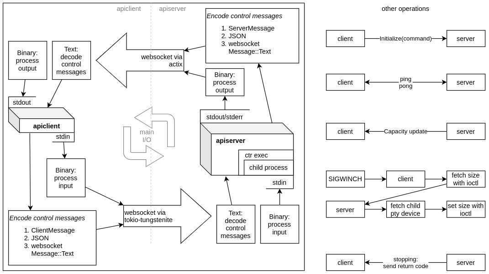

# API exec developer's guide

`apiclient exec` lets users run commands in host containers.
See [the apiclient README](apiclient/README.md#exec-mode) for a user guide.

This document describes how it works, focusing on architectural patterns and areas of interest that span client and server.
The code is liberally commented, so it's a good idea to read through, and this document will link to it when helpful.

## High-level architecture

When the apiserver gets a request to `/exec` it'll upgrade the request to a WebSocket.
This WebSocket is used for all communication with the client, including process data and control messages.
It doesn't block other API requests.

We use message-oriented communication rather than a continuing stream.
Messages are always processed in order.
WebSocket "Binary" messages are used for process input and output, which is unencoded.
WebSocket "Text" messages are used to pass control messages, which are multiplexed into [ServerMessage and ClientMessage types](https://github.com/bottlerocket-os/bottlerocket/blob/develop/sources/models/src/exec.rs), defined in the API model.
Control messages include things like initialization, heartbeat, capacity updates, window size updates, and the final return code.
To see how messages are handled, look at the implementations of `StreamHandler` in [the server](https://github.com/bottlerocket-os/bottlerocket/blob/develop/sources/api/apiserver/src/server/exec.rs) and `ReadFromServer` in [the client](https://github.com/bottlerocket-os/bottlerocket/blob/develop/sources/api/apiclient/src/exec.rs).

The server spawns the requested command using containerd, which launches it in the namespaces of the requested container task.
We create a PTY first, if the user requested, then funnel input and output through the WebSocket.
Ping and pong messages are sent regularly, called a "heartbeat", which lets us ensure the connection doesn't go stale.
Window size updates are sent to the server whenever the user's terminal size changes so that interactive programs are nice to use.
Capacity updates are covered below.

## Low-level architecture

### Resource management

The Bottlerocket apiserver uses actix-web, which can conveniently upgrade HTTP requests to WebSockets.
Just implement Actix's Actor trait and you can receive a stream of WebSocket messages.

On the other hand, the Bottlerocket apiclient uses tokio, so for WebSocket support, it uses tokio-tungstenite.

For simplicity, both sides use simple threads and channels to manage resources, except where actors or futures are an obvious choice.
This lets the code between apiserver and apiclient stay relatively similar, even though Actix and tokio handle async actions rather differently.

Both sides use a similar pattern to simplify the management of the threads and channels.
Each thread is owned by a struct.
If the thread needs access to an existing resource in the outside world, it's given a channel or Actor address to access it.
If the outside world needs access to a resource in the thread, the thread creates a channel and holds a handle to it in a field.

For example, see the Heartbeat struct in [apiclient's exec.rs](https://github.com/bottlerocket-os/bottlerocket/blob/develop/sources/api/apiclient/src/exec.rs).
It owns the thread that sends ping and pong messages to the server.
It's given a channel it can use to send the messages, and contains a field with a channel that the caller can use to be notified if the heartbeat dies.

Other things managed this way include the client receiving user input and server messages (see `ReadFromUser` and `ReadFromServer` in [the client](https://github.com/bottlerocket-os/bottlerocket/blob/develop/sources/api/apiclient/src/exec.rs)), the server receiving client input and process output (see `ReadFromChild` and `WriteToChild` in [the server](https://github.com/bottlerocket-os/bottlerocket/blob/develop/sources/api/apiserver/src/server/exec/child.rs)), and the client handling signals (see `HandleSignals` in [the client](https://github.com/bottlerocket-os/bottlerocket/blob/develop/sources/api/apiclient/src/exec.rs)).

### Capacity updates

Actix gives us a great way to communicate with the client over a WebSocket, but seemingly no way to control the receipt of the messages.
In a manual server implementation, you can control when you pull data from a network socket, and you can wait to pull more until you've processed the previous data.
In the Actor-based WebSocket implementation, you receive a stream of messages, and data is still being received as you process each message of the stream.
This can be a problem when the client needs to send a lot of data for processing; the buffers will keep filling up and can overload the server.

The typical solution to this is "backpressure," which means giving some kind of signal to the sender that they're overloading the channel.
Rust has bounded channels that accomplish this - notifying the sender that the channel is full - and indeed we use one to hold input from the user.
The trick here is that we don't control the input buffer, so we can't just "naturally" block network traffic - Actix controls that.

We fix this by sending regular capacity updates to the client.
Messages are processed in order, and the client knows how many chunks of input it's read from the user, so if we tell them how many of their messages we've finished writing to the process, and the maximum number of messages we'll allow outstanding, they can throttle themselves.
For example, if we allow 1,024 outstanding messages, the client has sent 1,024, and the server has written 0, the client knows it has to wait until some are written.
(If they don't, we terminate the connection.)

The client implements this by updating an `AtomicCapacity` in `ReadFromServer`, and waiting for there to be available capacity before reading more user input in `ReadFromUser`.
(`AtomicCapacity` just stores the numbers we get from the server, and can be shared across those two threads.)

We don't have to worry about capacity in the opposite direction because (1) the client only reads another message from the WebSocket stream when it's written the prior one to stdout, and (2) writing output on the client side is generally faster than the server plus the network.

### Terminal management

#### Terminal settings

If you start an interactive program from a shell, and you press ctrl-c, you want the program to stop so you can be returned to the shell.
If you run a program remotely, you want the same behavior - you don't want your ctrl-c to stop apiclient itself, it should be sent to the child process through the server.

The interpretation of ctrl-c is done by the "line discipline" that lives right above the input device driver in the kernel.
It also does things like interpreting your backspace character as an erase instruction, and line-buffering your input.

For the behavior we want (at least when the user has a TTY) we need to change the line discipline to "raw mode" so it won't interpret any keystrokes and we can send them directly to the server.
On the server side, the PTY emulates a terminal and interprets the keystrokes, accomplishing the desired action remotely.

We don't want raw mode to persist after our program is complete, though, or any other output in your terminal will be affected.
We make a [`Terminal`](https://github.com/bottlerocket-os/bottlerocket/blob/develop/sources/api/apiclient/src/exec/terminal.rs) type that changes to raw mode on creation if the user requested a TTY.
When it's dropped automatically at the end of the program, it resets the terminal settings to their original state.

We can also manually drop the Terminal earlier.
For example, this is useful when we know we're done with process input/output and may need to print error messages for the user - dropping Terminal will allow them to appear more normally.
(Sometimes an error happens during processing and is important enough to show immediately, even if we know the Terminal is still in raw mode; that just means it may not appear at the start of a line, so it'll look a bit funny.)

#### PTY setup

If the user calls `apiclient exec` from an interactive session, then the server creates a PTY for the requested process.
A PTY (pseudo-terminal, or pseudo-teletype) lets the server emulate a physical terminal.
Interactive programs generally require this so they can draw an interface, or at least know how wide to print their output.
(Specifically, we check if the user hasn't redirected stdin or stdout, or if they specifically requested a TTY with an argument.)

In this case, before we spawn the Rust `Command`, we create and configure a PTY using [`openpty` and `login_tty`](https://man7.org/linux/man-pages/man3/openpty.3.html).
We get back two file descriptors, one the parent can read from and write to, and one for the child, which `login_tty` conveniently turns into stdin/stdout/stderr for the child process.
Think of the file descriptors as a two-way channel between the parent and child process, with the benefit that the kernel interprets all of the special terminal signals for us.

In the non-TTY case, we use the normal `Stdio` interface of the Rust `Command`, but turn them into file descriptors so we can have the same interface as with a TTY.
We use an [OS pipe](https://man7.org/linux/man-pages/man2/pipe.2.html) to combine stdout and stderr, to match the PTY case where they're combined; we just write both stdout and stderr to one end, and read process output from the other end.

To see more, look at `ChildFds` in [the client](https://github.com/bottlerocket-os/bottlerocket/blob/develop/sources/api/apiclient/src/exec.rs).
